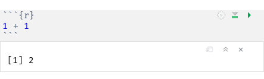

# Installing R

## Windows

1. Download [the newest R](https://cloud.r-project.org/bin/windows/base/)
2. Run the installer you just downloaded. Usually the defaulty options are good. Change if you know what you're doing.
3. Get [Rtools](https://cloud.r-project.org/bin/windows/Rtools/) in order to build/install packages.

## Mac OS X

1. Download [the newest R](https://cloud.r-project.org/bin/macosx/)
2. Make sure you have an X11 server, and you probably want to have Clang and GNU Fortran to compile packages when installing them - see details on the link above.
3. Install your pkg file(s).

## Linux

Most Linux distributions come with R in their repositories. Install from there if possible.

Here is some [information on installing for Linux](https://cloud.r-project.org/bin/linux/).

# Installing R Studio

R Studio is an integrated development environment ("IDE") to make working in R easier and faster. I'll be using it during the tutorials and I recommend using it too.

1. Download [R Studio Desktop](https://www.rstudio.com/products/rstudio/download/)
2. Select FREE and pick the version you need from the list to download.
3. Run the installer.
4. Start R Studio.

# R Studio interface

After step 4 you should end up with something like this:

There is a lot to see here, take some time to inspect some of it. The screen is divided into 4 panels or panes:

- **Console**/**Terminal** (left or bottom left): This is the command line interface to R. If you are not using R Studio, you will at least have the Console. All commands can be entered here, so you can test how to run any command here. There is also a system terminal that allows running system command from R Studio.
- **Source** (top left): This pane might not be open when first starting R, so don't worry if you don see it. It is a text editor to write scripts. It can have multiple tabs, in the example there is only one, an empty, unsaved file. Notice the 'Run' button that allows you to run part of a script in the Console.
- **Environment**/**History**/**Connections** (top right): In the Environment tab you can see all the datasets, variables and functions that you loaded or defined. The History tab has a list of all the previous commands you entered in the Console. Notice the 'Import Dataset' button that can be used to load data from several sources. You can open a data frame for inspection from the Environment tab, which actually opens a tab in the Source console. We will not be using the Connections tab, but we might encounter an additional **Git** tab in this pane.
- **Files**/**Plots**/**Packages**/**Help**/**Viewer** (bottom right): There are several utilities here. The three you will probably use most are: Files, which allows you to look at files and set the working directory (important when working with files, such as the data files for the tutorials); Plots, which has the figures you made of your data, and Help to look up how R packages and function work. We might also install a few packages in the Packages tab.

# R Introduction

R is both a way to do statistics and a scripting language. In this series of Tutorials we'll focus on programming, but there is another set of tutorials that focusses on doing classical statistics in R, and we might end up writing more tutorial sets.

If you want to get an overview of basics in R, I can recommend the book: "R In A Nutshell," 2^nd^ edition by Joseph Adler. Google this: `pdf r in a nutshell 2nd edition`. Chapter 3 is especially useful for people who have never written any code yet, but Chapters 1-5 are useful for everyone to at least leaf through and then more carefully read the sections that are relevant to you. The rest of the book is a great reference for all your future R work.

Alternatively, you could take the free 'Introduction to R' course on [DataCamp](http://www.datacamp.com). This has you _interactively_ type R commands to complete a set of excercises that introduce you to the basics in R. I just did it the other day and learned some new things myself.

These tutorials have you do similar things, but they focus on what we anticipate people will need when doing our type of research. Also, they will both have you do interactive exercises like DataCamp and they will form a reference for you in the future, like a book.

## R Notebooks

I will try to create R Notebooks with the necessary R code to do the tutorials. You can view them as HTML files, but you can also open them in R Studio where you can interactively play with the embedded code. This works through "code chunks", that look like this:

This is a simple example, but the gray part is the code chunk itself. The {r} part says that it has R code (other types of code are allowed as well), and on the top right are a few buttons. The green triangle button runs the code, and this might have some output: some text or figures, or maybe a file is stored. In this case, the result of the addition is shown: 2.

The code chunks in the other tutorials will do more interesting things, and often they will produce errors or not run at all. Those are exercises where you are supposed to complete or correct the code. This will also be mentioned in the text. Since most chunks of code depend on each other, these exercise chunks have to be done in order to run some of the chunks further on in the tutorial. If at first you don't succeed, you can correct the code and run it again, as often as you like.

## R scripts, sharing data and code

We won't start of with writing scripts, but will simply run code in chunks or in the console, but for real analysis, you need to document what you did anyway, so storing the analysis code in either a script or a notebook makes sense. Then at the end, we'll also see how we can share code on GitHub and share data on the Open Science Framework.
