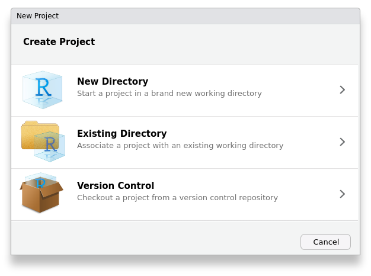

```{r setup, cache=FALSE, include=FALSE}
library(knitr)
opts_chunk$set(comment='', eval=FALSE)
#setwd(dirname(rstudioapi::getActiveDocumentContext()$path))
```

In the last few tutorials, including this one, you will learn how to organize your data, your R code and your manuscripts in ways that make it accessible to "other people". One person that you should always include in "other people" is your future self, but it will also include readers of your articles, such as reviewers, and people working on the same project with you. You want to do all of these people a favour so that if they have the data files and the code, they can re-run the analysis and produce the figures for your poster or paper. This means structuring and explaining the code, in several ways.

Some ways of making transparent code you already know:
- add comments explaining what code is intended to do
- put repeating bits of code in functions
- use understandable names for scripts, variables and functions

You're going to add some other techniques that optimize how to share your data and code with the wider scientific community. While there will be no writing of code (or editing faulty chunks) from now on, these parts might be more important than the previous ones as this is where it all comes together.

**Projects:** This is a way that R Studio allows you to bundle all the files that go with an experiment or study into one coherent whole. There are some great advantages of projects: 1) they set the working directory for you, so that all code runs relative to the main directory of your project, 2) you can put a whole project in a git repository and it it will work out of the box on someone else's computer (if they have R Studio), 3) they can store the state of R at point of the analysis where you had to stop, so you can switch between projects with no loss of time.

**Notebooks:** These are a form of "literate code". These tutorials are notebooks, so you already have an intuitive sense of how they work. You can write some explanation or intention and then put a few lines of code in a chunk. What I would usually do is write the long code that you will inevitably end up with in functions that you store in scripts, then `source()` those.

**GitHub:** GitHub allows people to publish code on the internet. Academics can get unlimited private space, but we want to make everything public anyway. Still it probably pays of to make sure you have an academic account. The advantage of GitHub (or any other git server) is that you can give people on your team the url to your project and they can synchronize the latest updates on the project to their computer automatically. They can even suggest improvements or additions to your code for you to review, or you can give them total access so they can change anything they want. For any paper you publish the code should be on GitHub.

**Open Science Framework:** or OSF, is a platform for scientists to put their projects on. It should host the data for your projects, and have a component that links to the GitHub repository for your project. You can even put pre-prints on PsyArXiv, which is a spin-off from OSF.

You'll start learning about projects and notebooks briefly, but all of this only makes sense in the context of working with GitHub and probably OSF. For example, before creating a project in R Studio you should create it on GitHub. So you should make sure to have an account on [GitHub](https://www.github.com) and [OSF](https://www.osf.io).

## Projects

First you'll wonder how you can start a project in R Studio. Well, you should use the projects menu for that. It is not in the main menu, as it supercedes it. The project menu is in the top right of the R Studio window:


It will show the name of the project you are currently working on, and it will allow you to switch to a few of the recent projects you've been working on. It will also give you some options to change your current project.

From that menu, you select the option "New Project...". R Studio might ask you if you want to save your current work, and after that is solved you will see these three options:




Converting an existing directory to an R Studio project is sometimes problematic, and since you haven't looked at GitHub options for version control yet, you should use the 'new directory' option for now. Make sure you create a new directory with a fitting name.

### Project names

When you create a project, it will have the name of the folder that you put it in. Don't put your R Studio project in a subfolder of the research project, but really put it in the main folder of your research project. R Studio will really handle all aspects of your project. For real projects the same name will also be on GitHub. Rules for project names:

- you can use capitals
- you can not use spaces or special characters (having spaces or special characters in folder names or website addresses is a nightmare)
- you should make sure it describes or at least "nicknames" your research adequately and that you would have no problem showing this to the world: all of it will be public all the time

Check out the project names in my screenshot. I am working on the R Tutorials in my project 'RTutorials'. That is the name it has in R Studio and on GitHub. There is no OSF counterpart yet, but I might put it there, if I ever decide that it should be a published booklet for example and I want to put it on PsyArXiv. In that case, it will also be 'RTutorials'.

Notice that I have a project called _TwoRatePredictions_ and one called _TwoRateProprioception_. Those are very similar names that sometimes confuse me. However, one was created and named by me, another by a lab member. If you can help it though, avoid confusing names.

### Folder structure

You will put certain folders in your project. These mimic the folders that are found in R packages, and some guidelines from the lab where I did my PhD. Organizing any project in folders like those is immensely useful, as all lab members can find their way around your project without wondering what is where: they already know. These are the two main folders:

- **R/** This folder will have the R scripts people can source, and that will be used in your notebook. The scripts should be organized by theme, and given short informative names. You will come to prefer single words, no capitals, spaces or special characters: it just makes it harder to type and keep your other code tidy.
- **data/** This filder will have your CSV data files.

Additionally, you can keep documents you produced in subfolders as well. By default, I will have a folder for figures. However, you should only have files on GitHub that can be opened in a text editor. So this excludes PDF's or Word documents, but includes R Markdown files and SVG files. You'll see how to exclude certain file types or specific folders from synching with GitHub in the tutorial on GitHub.

- **doc/** This folder will have documents with "output" of the project. Usually there are no files in this folder as they should all be sorted in some other folder:

- **doc/abstracts/** This is where you store abstracts for conferences.

- **doc/fig/** This is where your scripts should store figures.

- **doc/paper/** Here you could store drafts of your paper in some form or another. However, usually it doesn't make sense to share all drafts online, only the final version. So this folder could be in a Dropbox version of your project and shared with co-authors, but should not be on GitHub. Here, you will have many different versions of manuscripts, and these should all be dated, and signed in the file name, so that sorting files alphabetically on any computer allows sorting by date as well and shows who last edited the file. That means that the first part of the filename indicates the kind of document it is, the second indicates today's date in 8 numbers: YYYYMMDD (which will make alphabetical sorting the same as chronological sorting) and end with the initials of people who edited it on that day:

- `manuscript_20181130_mth.doc` 

So if you change yesterday's manuscript, the first thing to do is to save it with a different name: you change the date and remove all initials except your own. Since the document kind comes first, all versions of the same document are grouped, and since the date comes second, they are sorted chronologically. With all authors initials at the end you can also immediately see if somebody did any work on the manuscript while you weren't looking.

- **doc/posters/** This is where your SVG format posters live... probably made with InkScape.

- **src/** This is where you would store code in compiled languages, such as C++ or Fortran, so don't worry about it for now.

- **man/** This is where any manuals would go, also not so important for now.

- **lit/** This is where you should store three kinds of things: 1) pdf's of papers you cite, and we have a specific format for naming them, 2) the *.bib file if you use any references in any of your R Markdown files, such as your `rticles` as described in tutorial 12, and 3) summaries of the papers you cite.

Here is the format for naming PDF files. They should start with the last name of the first author and either the last name of the second author or if there are more than two authors it should have "et al" and it should have the year of publication. So basically this is how you would cite the paper in the text using APA style or similar.

You could put other author names between parentheses, if I know them. This allows me to use my computer's file manager to search for papers by certain authors.

After the year, we put the pubmed abbreviation of the journal name, the volume, issue and either the first page or the document ID for non-print journals.

Notice that the title is never in there.

Here are some examples:

- `Berniker and Kording 2011.PLoSCompBiol.7.10.e1002210.pdf`
- `Mikula et al (Khan Blohm) 2018.JNeurophysiol.119.5.1981.pdf`

# Notebooks

You should try to organize most of your files in the subfolders mentioned above, but there is at least one file that should not go in a subfolder, and that is the main notebook that will have to accompany your project. This is an "R Markdown" file with the Rmd extension. This file is less code and more text, and should guide readers through the project. So it is almost a paper, except that it will also point people to the right functions, code and datafiles and has much less background information. It should also produce the all the data figures and do all the statistical analyses that you will put in the final paper. The latter is important as it will serve as a reference for your co-authors (especially supervisors) who are likely not as intimately familiar with your data and code as you are. You can consider it supplementary information to your paper, so it is also the place for analyses and figures that will not end up in the paper.

Given the purpose of this Notebook it should also have a certain structure. I would write a short introduction that re-iterates the goal of the experiment(s). You can then describe the further contents of the Notebook to spell out how the data analyses and figures in the Notebook (help) achieve those goals. Then you should `source()` all scripts from the `R` folder in your project, while briefly stating the kind of code to be found in each file. You could also list all the figures you plan to include, or all analysis, or use a table of contents of some sort.

Then for each analysis you first show the data in a figure, and then all the statistics. All the while, the research questions should be repeated so that it is clear how your analyses answer the research questions.

At some point, you also want to store each figure as an SVG. This means that all functions that create figures should have an option to be displayed inline in the Notebook, or be stored as a file in the `doc/fig/` folder of your project - and they are called twice, once for each type of output. Ideally, you don't need any post-production work in InkScape to make your figures suitable for publication: they should roll out of the scripts as they appear in the paper. You can of course change the format of the figures so that the journal will accept them.

## Stand-alone code

One major advantage of Notebooks is that you export them to other formats, such as HTML, Word docs or PDF files. When you do that, R Studio starts a new instance of R, and it will run only the code in the Notebook. That is: none of the things that you typed in the console will be available. This ensures that anybody with the proper (data) files, the required packages installed and the Notebook will get the exact same results you get. It also puts a little pressure on you and forces you to write decent code for every step. While figuring stuff out it is OK to just type commands directly, but those are easily forgotten. Relying on stored R history in your own personal folder for anything to work is not reproducible, and using shared Notebooks forces you to have all parts of the analysis in sourced scripts or in chunks in your Notebooks. Either way: they can be used (and checked) by others.