```{r setup, cache=FALSE, include=FALSE}
library(knitr)
opts_chunk$set(comment='', eval=FALSE)
```

This tutorial doesn't really have any editable code chunks, as it explains how to use tools to manage your scientific projects using R and R Studio. We start with a short explanation of what GitHub and the Open Science Framework are for, and how they can interact, so you can get a sense for the big picture. Details will then have proper context..

_GitHub_

There are several advantages to using GitHub -- or another Git service or versioning system. GitHub first functions as a backup of all your code: you can go back in time to any point you "saved". It also allows easier sharing of code with others, as people can simply check out your GitHub repository. You can create branches to work on improving separate parts of your code, and you can receive "pull requests" from external people who've tried to make their own improvements. But even when you're just working on code on your own, using GitHub is beneficial.

Perhaps before reading through the rest of this text, you could do GitHub's own "Hello World" guide:

[Hello World Guide](https://guides.github.com/activities/hello-world/)

Which shows a little about how GitHub works and what the idea of Git is.

_The Open Science Framework_

The Open Science Framework (osf.io) started mainly as a repository for data, but can do much more now. It can be integrated with GitHub, it has pre-print servers, and OSF repositories can be registered to get their own DOI, and become cite-able units.

_Working with GitHub and the Open Science Framework_

In this notebook, I'll describe the basics of how to use GitHub from within R Studio, and how to integrate this with an OSF repository. The main idea is to use GitHub for code and development, and OSF as a data repository as well as the main public access point for your science project.

# GitHub

Start by making a [GitHub](https://github.com/) account here, and then a repository, the R Studio project with version control will be based on this.

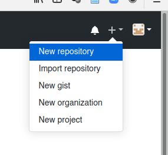

There are a few choices to make when creating a repo. First, the name of your repository should be memorable (descriptive) but still fairly short, as this will show up in lists of repositories / projects. I'd avoid spaces in repo names, as the GitHub repo name will also become a folder on your computer, and spaces in folder names are still not great. I keep all my GitHub repositories publis, but especially for a scientific project that will become a (published) paper, I would make it public and give it a GPL 3 license to keep it Open Access in all future forms. I'd write a short description, which will show up in the Readme file if you choose for that to be created, and I'd pick the appropriate language to start with a .gitignore file with content that usually makes sense.

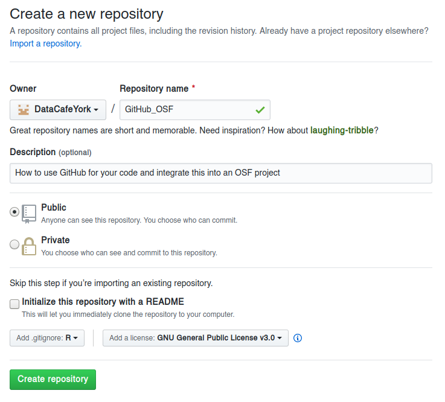

Finally, you need to get the link to the GitHub repository from the main page of the new repository:

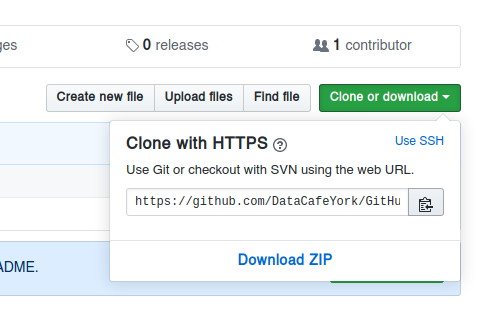

## Install Git

At some point before making an R Studio project that is connected to the GitHub repository, you need to install `git` on your computer.

You can download it here: [https://git-scm.com/](https://git-scm.com/), although on Linux (and maybe on Mac OS) you probably want to install it through your software manager, rather than manually doing it.

When installing `git` it will want to be associated with a text editor. You should pick one you like, or at least know how to use, because sooner or later you will probably need to use for something that R Studio doesn't (yet) do with some fancy buttons. I like [Atom](https://atom.io/), which was made by the people from GitHub, but you should pick whatever you like (as long as it isn't vim).

## R Studio project

This part assumes you're already familiar with R Studio Projects. By themselves, R Studio Projects already save you a lot of trouble, and this is compounded by basing your R Studio Project on a GitHub repo. This is why you first make a GitHub repo, and then a project.

First, in the top right of the R Studio window, there is a project drop-down menu, where you can choose to create a new project:

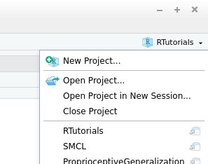

You want to create a "Version Control" project:

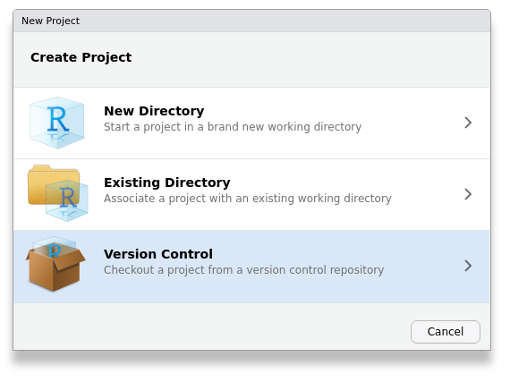

And to be precise, it has to be version controlled by git:

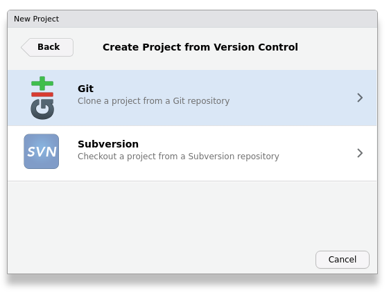

Finally, you copy the link to the GitHub project, and select where the folder for this project should be created:

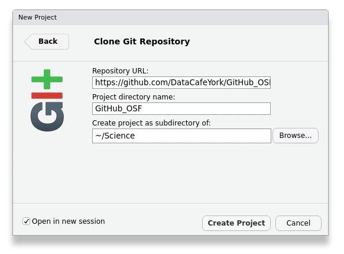

You then end up with a brand new, version controlled R Studio Project, that is easily synchronized with GitHub:

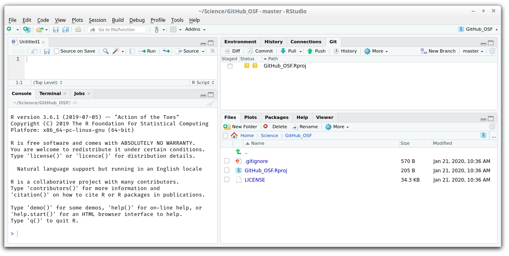

You can see the .gitignore file, with automatic content, as well as a LICENSE file and possibly a Readme. R Studio has created an .Rproj file, but don't worry, this will not be synced with GitHub: it is excluded by the .gitignore file. 

## Folder structure

For R Studio Projects, you'll probably want to start using the folder structure that is mandatory for writing R packages. You don't have to, but it makes life a little easier down the road. Generally, script files with source code, will go in a folder called `R`, data files should go in a folder called `data`, and in some cases you will have manual pages that should live in a folder called `man` and perhaps images in a folder called `img`. I would keep notebooks down to a minimum and put them in the main folder (with some exceptions: you can write books in R Markdown, and every chapter would be a seperate markdown file). Sometimes I have a folder for literature (`lit`) or output documents (`doc`) such as figures. Such a folder structure keeps your project organized. It will help others find their way around the projects, where "others" includes future you. While it is not mandatory for many languages (Python, Matlab), I'd still recommend to stick to something like this. Within reason you can create you own version of this folder structure.

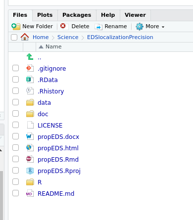

## Commit and Push & Pull

Once you have made some coherent changes to your code, you will want to store the new version of code. Do this as often as it makes sense, for example, after a set of changes that you may want to undo in one go. In R Studio this is built in. Whenever you have an R Studio project that is based on a GitHub repo, you will have a `Git` tab. The main area of this tab will list all the files that have been changed since the last commit. Files that are excluded based on a rule in the .gitignore file, will not show up here.

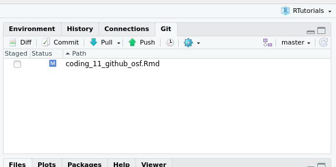

If you click on the `Commit` button, you can store the current versions of each file, accompanined by a comment stating what was done. You can also _commit_ multiple files with the same comment. In this commit window you can see the actual changes to that were made to each file (white lines stay the same, green lines are added, red lines are removed).

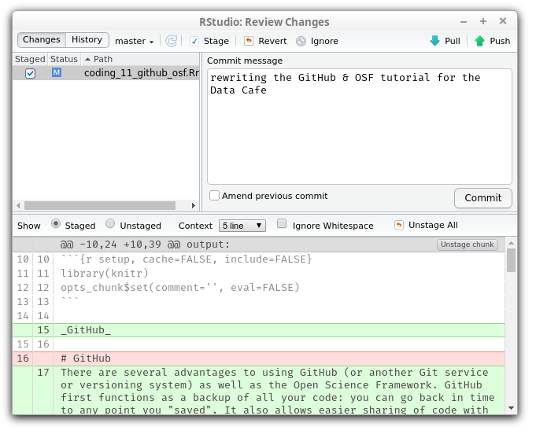

After pressing the "Commit" button on the middle right, you will get some feedback telling you if the commit worked or not.

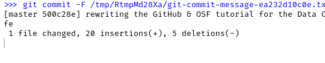


Once you have committed one or more changes, you can use `push` to synchronize your code with GitHub. When you hit the push button (either in the commit pop-up window, or in the Git tab), you will have to provide your username and password, as you are "pushing" the local copy of the code to the GitHub server.

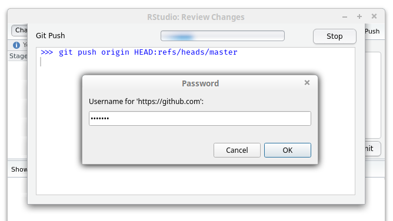

Some other systems may remember your password for you, but I like to remember my own. You will then get a message that will tell you if the push worked. It will look something like this if that is the case:

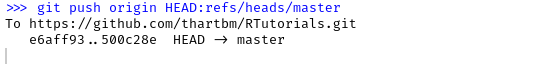

In case other people are working on the same project, you can synchronize your local version of the code with their work by pressing the `Pull` button in the `Git` tab (usually right after you open up R Studio and just before you continue work on the project). This pulls the current version of the code from the server to your local computer.

Each commit forms a time-point in your code development that you can push and pull.

## Branches

By default, each Git repo has 1 branch with the name 'master'. You can create new branches of your code. The purpose of branches is to split up work on separate parts of a project, perhaps even enabling coordinating contribubtions from several people. Usually, the non-master branches would have a name that reflects their purpose. In our work we don't often make branches, but it is easy to do in R Studio.

You will see the name of your currently checked our branch (probably "master") on the top-right of the Git tab of your project, with a drop-down menu. You can create a new branch by clicking on the purple icon next to it, and set some options for it. Most importantly (for now) the name. This should be memorable and appropriate.

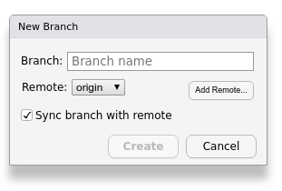

If you have multiple branches, you can then switch between them: you can work on your master branch, or perhaps add some code for a very experimental feature.

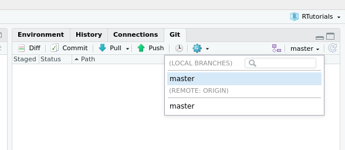

## History

The history of commits is the great power of using Git, or any other versioning system.

By pressing the `History` button with the little clock icon on the Git tab, you get an overview of your branches, and all commits, each with their date and comment. The newest stuff is on top. You can see how there are branches in the code. Sometimes these form dead ends, as some particular solution for a problem didn't work out, and you continued working on the master branch. Sometimes, they get merged back into the main branch, when all the changes turned out to be great. Each line in this overview is a commit. In this list overview you can go back in time and pull a previous version of the code. You can then also retroactively create a branch, for example, when all your work went horribly wrong.

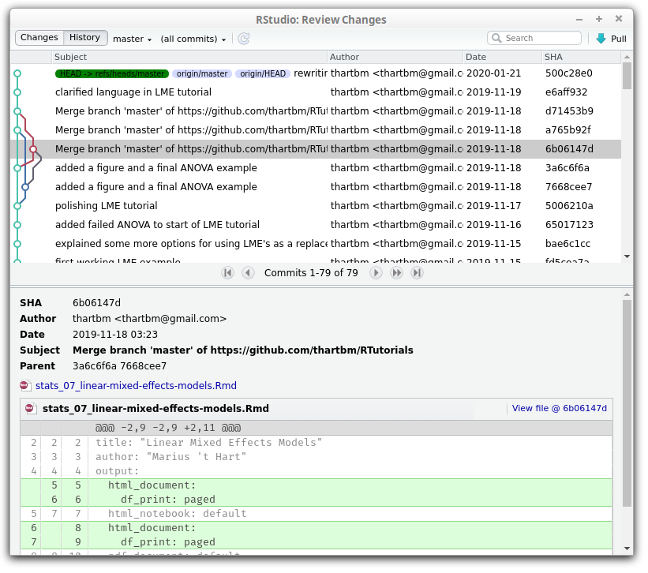

## Issues

A feature of GitHub is that people can file "issues" for any project (well, any project that is public or that they work on). These act as a to-do list for improving the code, and since people can reply to them, it can collect information that may be helpful for solving each issue. They have some more options, but you can figure those out yourself. Issues won't show up in R Studio, as they are not a core feature of Git or other versioning systems, but they may still help.

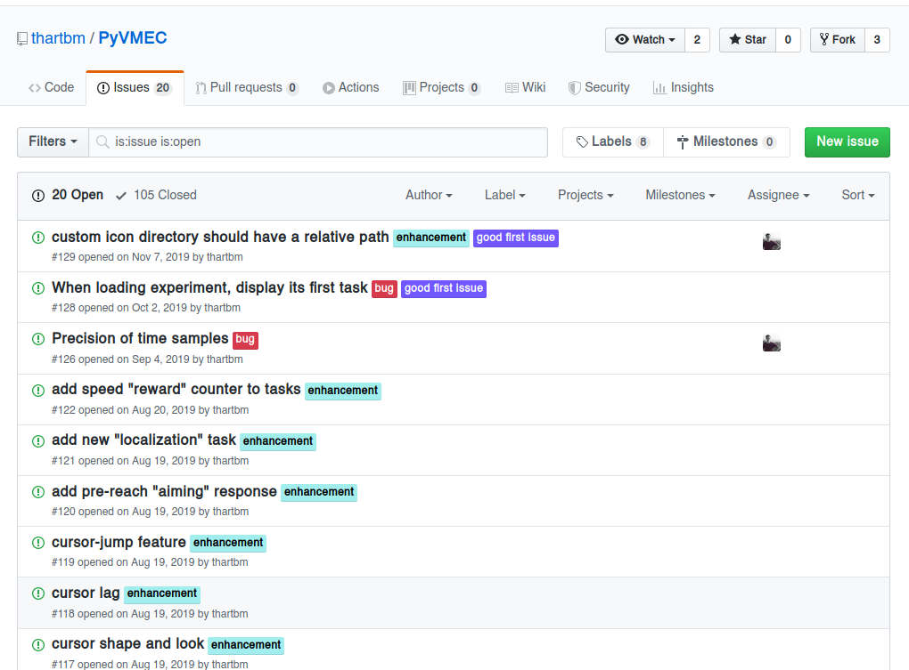


# Open Science Framework

Git and GitHub are very good at keeping track of the version of any file that is "diffable". Usually this is restricted to some form of ASCII text files, like most source code, but this also includes markdown files, html pages and for example LibreOffice documents. What Git is not good at is host large, and/or binary data files, for that you would want to use a data repository.

The Open Science Framework started out as mainly a data repository. It works a bit different from other data repositories. For most of them you upload the data once, and then can't change it. The idea is that scientists shouldn't fudge their data. However, sometimes, during revision, you need to include some extra data, or discover that the data cleaning or pre-processing wasn't optimal. So you'd want to legitimately update the content of the repository. This _can_ be done on OSF.

What you can also do is "register" a version of your OSF repo. You can't change that registered version anymore. The only thing is that in some cases you can delete it. So usually, when a paper is accepted, you'd register the OSF repo, so that readers can be fairly sure that the content of that repository is the real deal.

In addition to this insurance against tampering, but done in a flexible way, you can also get a DOI for your OSF repo. This makes the OSF repository a citeable unit. Currently, in our papers' methods sections, we cite the OSF repo so that people get access to the data.

When creating an OSF repository, you can pick from several servers that will host the data. Those servers are subject to the laws of the country they are in. There is a server in Montreal, which would be a very good candidate, as it somewhat protects the data. There's currently also one in Frankfurt and one in Sydney. The default is in the US, but laws that are supposed to protect data to some extent (you as a user of OSF generate data as well) aren't great in the US. To be fair, I'm not entirely sure what the implications are, but Germany, Canada and Australia have better reputations in this area.

Once you've set up a data repository on OSF, you can link it to a GitHub repo that you own / control. However, you first need to tell OSF what your GitHub account is. This can be done by going to your profile, then edit profile, and then on the "social" tab, go to the line for GitHub and put your GitHub user name there. This may need to be authorized.

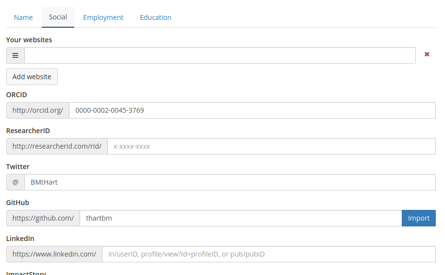

Now you can go to an OSF project, and on the "add-ons" tab, you should first _enable_ GitHub. Below the list of possible add-ons, you can now pick the GitHub repository from your GitHub account, and if you go back to the main page of the OSF project, the GitHub files will show up in the file tree.

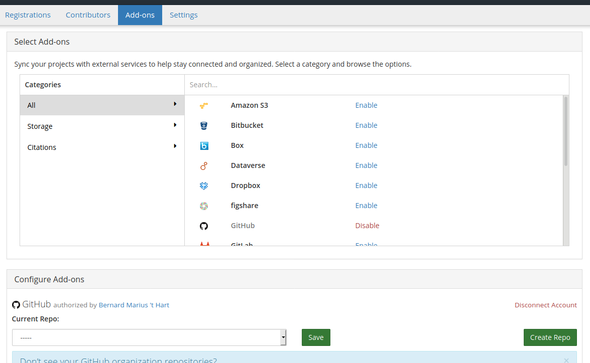


**Warning:** the GitHub files are not part of the registration of the project. Maybe this will change in the future, or at least it might go to the branch and date that you could indicate when registering.

# Contributing to another Git repo

In order to directly contribute to someone else's GitHub project, you need to first fork their project. (Wellll, need to... It's the polite way as it involves the least amount of work for the other party.) Any project should have a fork button on it, but you can only see/use this when you're logged into your account. This creates a full copy of the project on your GitHub account. Then also declare the "upstream" repo somewhere, in your local git version of the project, which has to be done in the Terminal (or another Git GUI) for now.

## Terminal

Some of this stuff can't by done with the minimal GUI interface for Git that comes with R Studio. You can either install a third party Git GUI, or use a few shell commands. (I still want to see what happens when you point Atom to your R Studio Project folder in this case.)

R Studio comes with a `Terminal` tab, which by default is right next to the R Console. Here you can type all the operating system commands that you want, including calls to the git binary running on your computer.

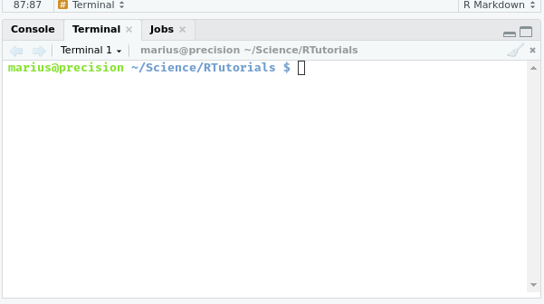

When you type:

```{bash}
git remote -v
```

Into the R Studio Terminal tab, you should get a list of the branches of your git project. There are usually at least two sources, each on their own line. If you didn't link your repo to an upstream git repo yet, those lines start with 'origin'.

You can then add the upstream repository with this command:

```{bash}
git remote add upstream https://github.com/ORIGINAL_OWNER/ORIGINAL_REPOSITORY.git
```

Replace the URL with the actual URL for the upstream repository.

If this command completes successfully, the earlier command `git remote -v` should now also have some lines that start with 'upstream'.

Now git is ready to pull in changes from the upstream repository. First, we get a fresh copy of the upstream repository:

```{bash}
git fetch upstream
```

And switch to the local branch (in this case 'master') that we want the upstream changes to be reflected in:

```{bash}
git checkout master
```

And then we can merge the upstream master with the local master:

```{bash}
git merge upstream/master
```

If some changes need to be committed first and you run this from command line, git will drop you into it's standard text editor to write the commit message.

## Vimbo: vim limbo

By default this is `vim` which works very differently from what you may be used to. In particular, everything works with keyboard shortcuts. In this case, you can simply edit the one line for the commit message, and then press `Esc` and then `:wq` to save the file and exit `vim`.

## GitHub Guides

GitHub provides a number of guides, similar to these tutorials. They seem useful and go into more detail:

[GitHub Guides](https://guides.github.com/)

## Happy Git with R

You can get more in depth info on how to use Git with R in Jenny Brian's book:

[Happy Git with R](https://happygitwithr.com/)

It's a great book, and you can get the source code for the book from GitHub:

[jennybc/happy-git-with-r](https://github.com/jennybc/happy-git-with-r)

## Unfinished topics:

1. How to handle pull requests someone makes for your GitHub repo.
3. Explain .gitignore somewhat.
