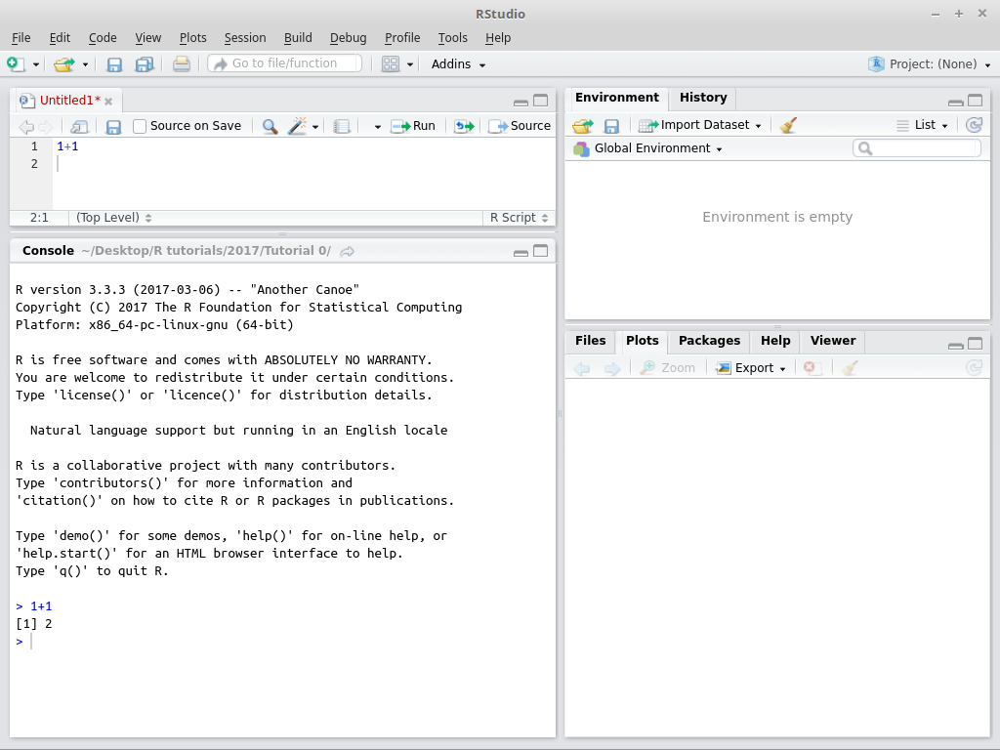

```{r setup, cache=FALSE, include=FALSE}
library(knitr)
opts_chunk$set(comment='')
```

# Starting a script

First we need to create a script. This can be done through the File option in menu, or through the drop-down button next to the new file icon (with a plus in a green circle):


</br>&nbsp;

As you can see, it's the first option in the drop-down menu and has the short cut: CTRL+SHIFT+N. Once you hit this, a new tab will open in the Source pane, and the Source pane will be opened if it wasn't already. Once you have tried out some commands in the Console, you should put the ones that work in your script, and save the script regularly. You can run the whole script by clicking the Run button at the top of the tab for your script in the Source pane.


&nbsp;

Here, I have created a very simple script to calculate `1+1` and then hit the Run button. You can see that the correct answer is also "returned" in the Console.

Now I will save the script in a folder where I already downloaded the R data file for tutorial 1, and will set that folder to be the working directory. Look in the next screenshot: if you go to the Files tab, on the right there is a button with "..." on it, which you can use to navigate to any folder. Go to the folder where you saved the data and the new script. There is a 'More' drop-down menu, where you can select to set the current dirctory as your working directory. This will put a command in the Console to set the working directory. You can copy-paste this to your script, so you won't have to do this manually every time.

# Getting the data into R

Dr. Smith wants to determine if the students in her statistics class understood the material taught in class over the previous week. She asks the students to write a short quiz to assess their knowledge. Below are the test scores for males and females in the class. We are to analyse this data for her.

First we load the data. In R Studio, you can open an rda file by double clicking on it, by hitting "Import Dataset" in the Environment tab, but we can also use the `load()` function:

```{r}
# set the working directory to the folder that has the data files, this works for me:
#setwd("~/Desktop/R tutorials/2017/Tutorial 1")
load('Tutorial_1_StatsQuiz.rda')
```

You can see that a data frame appeared in the Environment tab. It's called 'Tutorial_1' and has 43 observations of 2 variables. If you click on the table icon to the far right, this will open a new tab in the Source pane, where you can see the contents of the data frame in full detail.

By now, your R Studio window should look something like this:

  
&nbsp;

The advantage of using a command to load the data is that we can put it in a script. We can also read it from the .csv file:

```{r}
Tutorial_1 <- read.csv('Tutorial_1_StatsQuiz.csv')
```

R can also read SPSS files and many other formats, but that usually requires special packages and special commands that I will not cover here.

I will rename the 'Tutorial_1' data frame to 'quiz', which is more informative about the content of the data frame... and is easier to type. We can assign values (scalars, strings, lists, matrices, data frames, etc. to named variables with the "gets" operator that looks like an arrow. We can remove variables from memory with the `rm()` function. 

```{r}
quiz <- Tutorial_1
rm(Tutorial_1)
```

Now, the Environment panel will no longer show the Tutorial_1 data frame, but will instead show a quiz data frame. The data frame contains quiz scores for males and females. In R Studio you can inspect everything in the Environment panel and for data frames there is little icon on the right that will open a new tab in the Source panel. But we can also get an overview of any variable using the `str()` function:

```{r}
str(quiz)
```

This tells us there are 43 rows and 2 columns in this data frame. In this case, 43 people that took the quiz and we have two pieces of data on them: their gender and their score on the quiz. We're also shown the names of the columns: 'gender' and 'score'. These names make intuitive sense, so that we know which information is in which column.

Up to a limit we can see the content of a column of the data frame using the $ operator in between the data frame name and the column name:

```{r}
quiz$score
```

On the first line of the output we see a `[1]` which indicates that the first number on that line of the output has the index 1 in the list. If we asked for a long list, there might be more lines of output, and then the number between square brackets will also be higher.

We can take a subset of such a list using square brackets in two ways: 1) indicating the numbers of the items we want, or 2) using logical indexing. Here, we need the second way, because we want a list for males and one for females:

```{r}
males <- quiz$score[quiz$gender == 1]
females <- quiz$score[quiz$gender == 2]
```

## Exercise A

*What are the mean, median, standard deviation, and variance for males and females separately?*

We can have a peek at the distribution of a list of numbers with the `summary()` function:

```{r}
summary(males)
summary(females)
```

This gives us the minimum and maximum values, the mean and median, as well as the 1^st^ and 3^rd^ quantile. This information already shows us that the males might not be entirely normal. In the male students, the distance between the 3^rd^ quantile and the maximum, 9.25, is much larger than the distance between the minimum and the 1^st^ quantile, 2. In the female students this is 3 and 2, respectively, which are much closer together. This means that the distribution of quiz scores in the males may have a very long tail.

We can get the standard deviation with the `sd()` function and the variance with the `var()` function:

```{r}
sd(males)
var(males)
sd(females)
var(females)
```

The variance in the male students is much higher than in the female students. We could also have calculated the mean and median for each group with the `mean()` and `median()` function.

## Exercise B

*Construct a histogram, and box plot for males and females separately.*

R comes with a `hist()` function to create a histogram and has `boxplot()` to create a box-and-whisker plot. I will put all four plots in a single figure with several subplots, so we cab easily compare the histograms and box plots. I will also add Q-Q normal plots, which should have all data points on a straight, inclined line if it is normally distributed. You won't need Q-Q normal plots for the assignments, but they show you there are many more tools available.

```{r fig.height = 9, fig.width = 6}
par(mfrow=c(3,2)) # this puts subplots in a 2x2 grid
dscale <- c(0,16)
hist(males,main='males',xlim=dscale)
hist(females,main='females',xlim=dscale)
boxplot(males, main='males',ylim=dscale)
boxplot(females, main='females',ylim=dscale)
qqnorm(males,main='males: Q-Q normal plot',ylim=dscale)
qqnorm(females,main='females: Q-Q normal plot',ylim=dscale)
```

Note that we made sure that the x-axis of the histograms, and the y-axis of the box plots, are the same. This allows easier comparison of the two distributions. The scale of the data matters, in this case, it visualizes the difference in the means between the two groups.

## Exercise C

*What can these figures tell you about your data?*

We can see the distibution of the data, and any outliers. We could (should?) do tests of normality, but a plot is a very good way to get some insight into a dataset. The data for the female students looks close enough to normal, but for male students there might be a problem.

## Exercise D

*What would you consider to be a normal distribution? Describe the shapes of the distributions for males and females?*

The well-known "bell curve" is a prototypical normal distribution. To illustrate it, we'll make use of R's ability to simulate data from many distributions, including the normal distribution.

```{r fig.height = 3, fig.width = 8}
bellcurve <- rnorm(1000) # this draws a thousand random numbers from a normal distribution
par(mfrow=c(1,3))
hist(bellcurve, main='normal distribution')
boxplot(bellcurve, main='normal distribution')
qqnorm(bellcurve, main='normal distribution')
```

A perfect normal distribution generated with this R function would have a mean of 0 and a standard deviation of 1. Let's check this.

```{r}
summary(bellcurve)
sd(bellcurve)
```

Close enough! Note, since the numbers are random, the figures will look different every time. You can rerun these two code snippets a few times to get an idea of what normally distributed data looks like. It also shows that even though all the random numbers come from the same normal distribution, a few are usually marked as outliers when making a box plot. This means that 'outliers' can be true values. Some people deal with outliers by removing them, but others think that is manipulation of data.

## Exercise E

*How might you address non-normality?*

First, we could run a test to see if the data is normally distributed.

```{r}
shapiro.test(males)
shapiro.test(females)
```

For our male students, the p-value is below .05, which indicates that the distribution of their quiz scores likely deviates from normal. For females the p-value is much higher so that we are reasonably sure their data is normally distributed.

There are several ways to deal with non-normal data.
1. We can transform the data, for example, take the square root, or take a logarithm of the data with base, 2, 10 or e. This makes most sense if the data is skewed. It does make it somewhat harder to interpret the outcome of a test, as the data is now in a different range than the measurements.
2. We could also remove outliers. This makes sense if the data is mostly normally distributed, except for a few strange values.
3. Alternatively, we could drop the asusmption of normality, but then we are forced to use non-parametric tests. However, non-parametric tests can be somewhat limited and most parametric tests are fairly robust against violations of normality. We will not look at this possibility here.

Let's try some transformations on the quiz scores of the male students:

```{r}
sqrt.males <- sqrt(males) # take the square root of every score
log.males  <- log(males)  # take the natural logarithm of every score (with base=e)

shapiro.test(sqrt.males)
shapiro.test(log.males)
```

Those transformations seems to work: both the p-values are now above .05. Note that we need to do the same transformation on the female scores if we want to compare them in a test. Is this the right thing to do?

What if someone told us that they heard that one of the male students had some of the quiz answers and shared them with his friends? In this case, we might look at our box plot again and notice there are three males with exceptionally high scores. While we have no proof that they cheated, if we are interested in the difference between male and female students (to help us teach better next year) it would be reasonable to remove them.

The `boxplot()` function not only creates a boxplot, it also returns some useful information. It can tell us the values of the outliers (not the indexes), but that's still useful.

```{r}
mbp <- boxplot(males, plot=FALSE) # I don't want the plot this time, so I set it to FALSE
mbp$out # using the $ notation on the information, we can get a list of values that are considered outliers
```

In this case we want to _remove_ all values that are 12, 13 or 15. In other words, we want to _keep_ every quiz score lower than 12.

```{r}
males # the three outliers appear almost at the end of the data
males < 12 # this is mostly TRUE and only FALSE for the three outliers
males[males < 12] # this is called "logical indexing": only the values where 'males < 12' is TRUE are kept
shapiro.test(males[males < 12]) # let's see if this is normal

norm.males <- males[males < 12] # this way we can use it later on
```

Removing these outliers also works to get the data normally distributed. Which approach is best? It depends a bit on what we know about the data and about what is common practice in the field. Simply removing data that you don't like will be frowned upon, but if you have good reasons it may be acceptable. Transforming the data may work, but also has it's drawbacks. For your own research, you will really need to know your data and make an informed decision. Creating box plots and histograms and getting summary statistics will help you get to know your data.