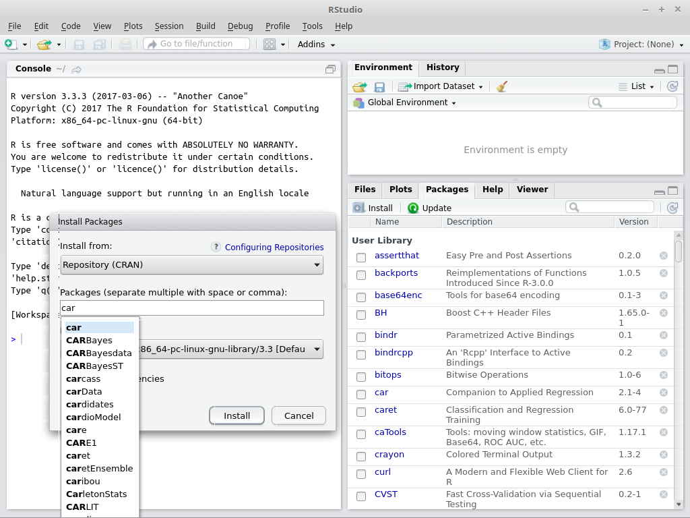

```{r setup, cache=FALSE, include=FALSE}
library(knitr)
opts_chunk$set(comment='')
#setwd("~/Desktop/R tutorials/2017/Tutorial 2")
```

# Exercise A: one-sample t-test

_Dr. Smith randomly samples 15 Graduate Kinesiology students attending York in order to determine if the mean IQ of Graduate Kinesiology students at York is significantly greater than the population mean IQ ($\mu$ = 100, $\alpha$ = 0.05)._

_IQ Scores: 102, 115, 91, 109, 121, 129, 116, 93, 115, 96, 105, 110, 99, 102, 101_

First we load the data and check what it looks like.

```{r}
load('data/Tutorial_2A_IQscores.rda')
IQscores <- IQscores$IQscores # this will make our life a bit easier
summary(IQscores)
```

We can even make a few plots:

```{r fig.height = 3, fig.width = 8}
par(mfrow=c(1,3))
boxplot(IQscores, main='Boxplot of IQ scores', ylab='IQ scores')
hist(IQscores, xlab='IQ scores')
qqnorm(IQscores)
```

This looks fairly normally distributed, and that is confirmed by a Shapiro-Wilk test:

```{r}
shapiro.test(IQscores)
```

There is a function to do t-tests in R that is called `t.test()`. Let's run it!

```{r}
t.test(IQscores)
```

What does this tell us? Does this answer the question if the IQ scores of Kinesiology students is higher than that in the general population?

Let's look at the help information of the t-test:

```{r}
help(t.test)
```

Looking at the "Default S3 method", there are three relevant bits of information we can learn from that help page to run our test:

1. The first argument to the function will be our list of IQ scores, and we don't have to name it, or specify that there is no other sample.
2. We can specify if we want to test wether our sample is larger, or smaller than some given $\mu$ or that we have no a-priori hypothesis by setting the `alternative` argument to: 'greater', 'lesser' or 'two.sided' (or just 'g', 'l' or 't').
3. If we don't specify the mu argument, it will be set to 0.

> Note: "S3" comes from S-language version 3.

Since we think the IQ scores of Kinesiology students are higher than those in the general population, and the theoretic mean IQ score in the population should be 100, we will run this t-test:

```{r}
t.test(IQscores, alternative='greater', mu=100)
```

What does the output mean?

# Exercise B
_Dr. Jones wants to know if the coping skills of children at 12 years of age are better than those of children at 10 years of age. Below are the coping scores for 10 and 12 year old children._

_10 year olds: 18, 19, 22, 21, 19, 23, 20, 21, 25, 22, 25, 24, 17, 18, 20, 15, 17, 17, 19, 19_

_12 year olds: 19, 20, 20, 21, 21, 18, 22, 24, 23, 16, 20, 24, 25, 24, 18, 19, 22, 21, 18, 20,_

Let's load the data.

```{r}
load('Tutorial_2B_AgeCoping.rda')
str(AgeCoping)
```

Notice that Age is already a factor.

## Exercise B1: independent sample t-test
_Assume these scores are obtained from randomly sampling twenty 10 year old children and twenty 12 year old children. Are 12 years old children better able to cope than 10 year old children?_

We could extract the scores for the 10 year-olds and for the 12 year-olds in two vectors, and provide those as input to the `t.test()` function, like this:

```{r}
yo10 <- AgeCoping$Score[AgeCoping$Age == 1]
yo12 <- AgeCoping$Score[AgeCoping$Age == 2]
t.test(yo10, yo12)
```

However, if you go back to the help page for R's t-test function, there is also an "S3 method for class 'formula'" which we can use for this particular dataset. We also have a hypothesis for the direction of the effect: the younger kids (Age = 1) should score less on the coping test. We can add this to the t-test.

```{r}
t.test(Score ~ Age, data=AgeCoping, alternative='l')
```

What does this result mean? If we remove the alternative argument, or set it to two-sided, do we get the same result as before?

Notice that it says "Welch's Two Sample t-test". This is a version of the t-test that does not assume equal variance in the two samples. By default R sets the argument `var.equal=FALSE`, and this is only used for independent-sample t-tests. For one-sample t-tests and paired-sample t-tests it does not apply. You can override this by setting `var.equal=TRUE` in the command:

```{r}
t.test(Score ~ Age, data=AgeCoping, alternative='l', var.equal=TRUE)
```

In this case it doesn't seem to matter much, this could be because the variance is actually equal in both groups.

Let's explore some options to see if the variance of two samples is equal or not. First, we can just see what the variances are:

```{r}
var(yo10)
var(yo12)
```

The variance is somewhat higher in the 10 year old kids, but is the difference significant?

I know four tests for the homogeneity of variance in two samples:

1. F-test: `var.test()`,
2. Bartlett's test: `bartlett.test()`,
3. Levene's test: `levene.test()` or `leveneTest()` from the `car` package, and
4. Fligner-Killeen test: `fligner.test()`.

Levene's test and the Fligner-Killeen test are more robust than the F-test and Bartlett's test, but Levene's test seems to be a standard of sorts, so let's try this test out on our data. It is not part of R by default, but comes from a "package", an extension of R if wyou will. You can go to the **Packages** tab and see if you have `car` installed. If not, install it now. This can be done through the **Packages** tab:


&nbsp;

You can also install packages with the following command:

```{r}
#install.packages('car')
```

This might take a little time, especially if R needs to compile code. The first time you compile code, R might also have to install package that allow it to compile code. But then you are set to install many more useful packages later on.

```{r}
library(car)
leveneTest(Score ~ Age, data=AgeCoping)
```

What does this mean?

As you can see in the help page (`help(leveneTest)`), this test can use different functions to estimate the centre of each distribution. The original Levene's test uses the mean, but this one uses the median which is more robust. This implies that if you get another result in another statistics package, it might use a different way to estimate the centre of the distribution. In R you can change the behavior of the function so that you compare the results with that of other statistical packages.

If we have confidence in Levene's test, we can safely use a Student's t-test as well as a Welch's t-test. Recently, a paper appeared that argues that _psychologists_ should always use a Welch's t-test. The argument is simple: if the variance is equal, you will get the same result, if it is not, you will get a more accurate result. Since this likely applies to kinesiologists as well, my advice is to not change the default setting of R to not assume equal variances.

If you're interested, here is the paper:
Delacre M, Lakens D, Leys C, (2017). [Why Psychologists Should by Default Use Welch's t-test Instead of Student's t-test](https://www.rips-irsp.com/articles/10.5334/irsp.82/). Int Rev Soc Psychol, 30(1), 92-101.

## Exercise B2: paired sample t-test
_Assume these scores were derived from testing the coping skills of a random sample of children at age 10 and again at age 12. Are 12 year olds better able to cope than 10 year old children?_

We will now do a "paired" t-test:

```{r}
t.test(Score ~ Age, data=AgeCoping, alternative='l', paired=TRUE)
```

What does the result mean?

Notice that the output says this is a _Paired t-test_, not a _Welch's t-test_ anymore. Why?

Compare the previous output with this:

```{r}
t.test(yo10 - yo12, alternative='l')
```

Because the t-test is paired, it is equal to a t-test of the difference between the 10-year and 12-year scores compared to a $\mu$ of 0. This means there is only one set of data, and it no longer makes sense to see if the variance of the one sample is equal to itself. Hence, we can now do a simple _Student's t-test_ without disadvantage.